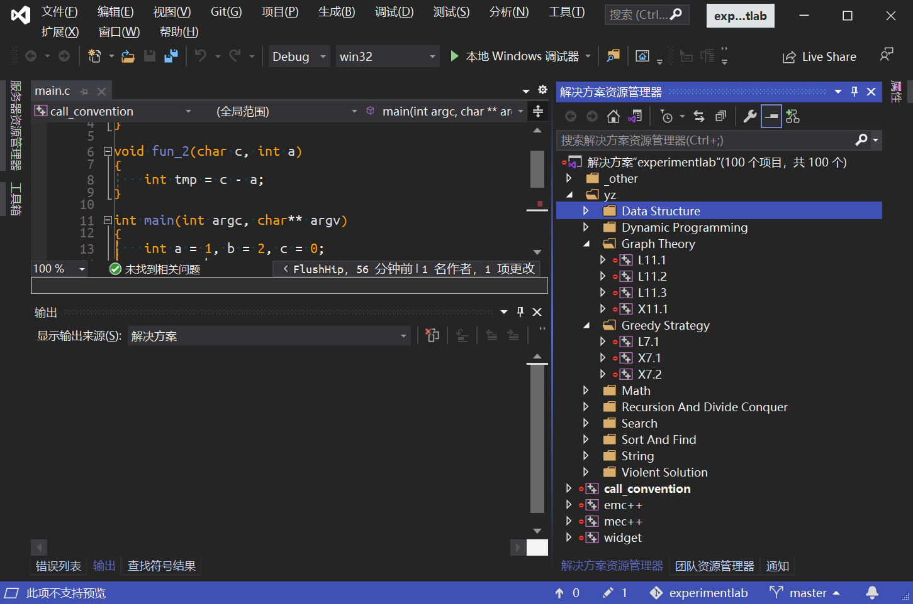

# CMake获取当前目录名以及获取上层目录名

 CMake中有两个变量，可以获取到当前`CMakeLists.txt`的当前目录名（绝对路径）和当前文件的绝对路径，分别是`CMAKE_CURRENT_SOURCE_DIR`和`CMAKE_CURRENT_LIST_FILE`。

但是，有时候需要的往往是相对路径名。比如我们编写项目的一些样例，以**当前文件夹的名字作为`target`名**，同时还需要把**生成的`target`按照上层目录名来分组**，例如下列目录结构：

```sh
examples
	|- base
		|- string
			|- CMakeLists.txt
			|- base.h
			|- base.cpp
			|- main.cpp
		|- core
			|- CMakeLists.txt
			|- main.cpp
	|- network
		|- tcp
			|- CMakeLists.txt
			|- main.cpp
```

这个项目需要生成*Visual Studio*项目，`CMakeLists.txt`如下所示：

```cmake
# remove last end of "/"
string(REGEX REPLACE "/$" "" CURRENT_FOLDER_ABSOLUTE ${CMAKE_CURRENT_SOURCE_DIR})

# get current relative dir name and set target name
string(REGEX REPLACE ".*/(.*)" "\\1" CURRENT_FOLDER ${CURRENT_FOLDER_ABSOLUTE})
set (TARGET_NAME ${CURRENT_FOLDER})

# init target
add_executable (${TARGET_NAME} ${ARGN})
target_include_directories (${TARGET_NAME} ${CMAKE_CURRENT_SOURCE_DIR})

# get above dir name and set target group name
get_filename_component(SECOND_FOLDER_ABSOLUTE ${CURRENT_FOLDER_ABSOLUTE} DIRECTORY)
string(REGEX REPLACE ".*/(.*)" "\\1" SECOND_FOLDER ${SECOND_FOLDER_ABSOLUTE})

# group target
set_target_properties (${TARGET_NAME} PROPERTIES FOLDER "examples/${SECOND_FOLDER}")
```

生成后的项目如图所示，这里借用一个**项目结构相同**的项目来展示。


进入正题，获取相对路径的目录名有两种方式：

- 利用字符串正则表达式替换

  ```cmake
  string(REGEX REPLACE <regular_expression>
         <replacement_expression> <output_variable>
         <input> [<input>...])
  ```

- 利用命令`get_filename_component`

不管哪种，都要先去掉绝对路径后面的`/`。

## 正则表达式

```cmake
string(REGEX REPLACE ".*/(.*)" "\\1" CURRENT_FOLDER ${CURRENT_FOLDER_ABSOLUTE})
```

**使用括号来保存子表达式的匹配结果，子表达式匹配的就是相对路径的目录名**。这种用法可以参考[google protobuf](https://chromium.googlesource.com/external/github.com/google/protobuf/+/v3.0.0-beta-1/cmake/CMakeLists.txt#26)的写法。

获取上层目录也是简单的，只需要使用正则表达式替换掉当前目录名，然后再执行一次获取当前目录名即可。

```cmake
string(REGEX REPLACE "(.*)/${CURRENT_FOLDER}$" "\\1" SECOND_FOLDER_ABSOLUTE ${CURRENT_FOLDER_ABSOLUTE})
string(REGEX REPLACE ".*/(.*)" "\\1" SECOND_FOLDER ${SECOND_FOLDER_ABSOLUTE})
```

这里要清楚正则表达式之中的括号子表达式和`"\\1"`的含义就行了[Search and Replace With Regular Expressions](https://cmake.org/cmake/help/latest/command/string.html?highlight=regex#search-and-replace-with-regular-expressions)，千变万化都可以。

## `get_filename_component`

这个命令就更好理解了，**把目录名当成文件名**就行了；

获取当前目录名：

```cmake
get_filename_component(CURRENT_FOLDER ${CURRENT_FOLDER_ABSOLUTE} NAME)
```

获取上层目录名：

```cmake
get_filename_component(SECOND_FOLDER_ABSOLUTE ${CURRENT_FOLDER_ABSOLUTE} DIRECTORY)
get_filename_component(SECOND_FOLDER ${SECOND_FOLDER_ABSOLUTE} NAME)
```

## 后记

后续可能会讲一下图片这个项目的项目组织结构如何用CMake组织起来，这个项目是我的实验项目，里面有很多实验，还有考研机试的一些练习，因此里面超多的`target`。